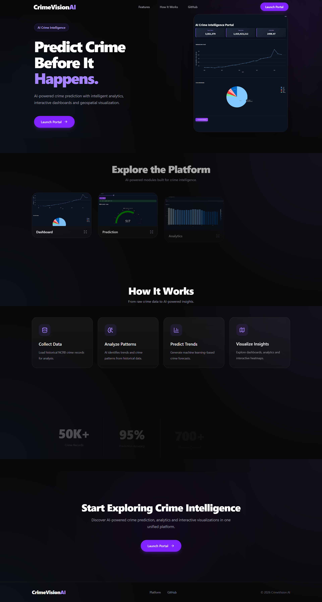
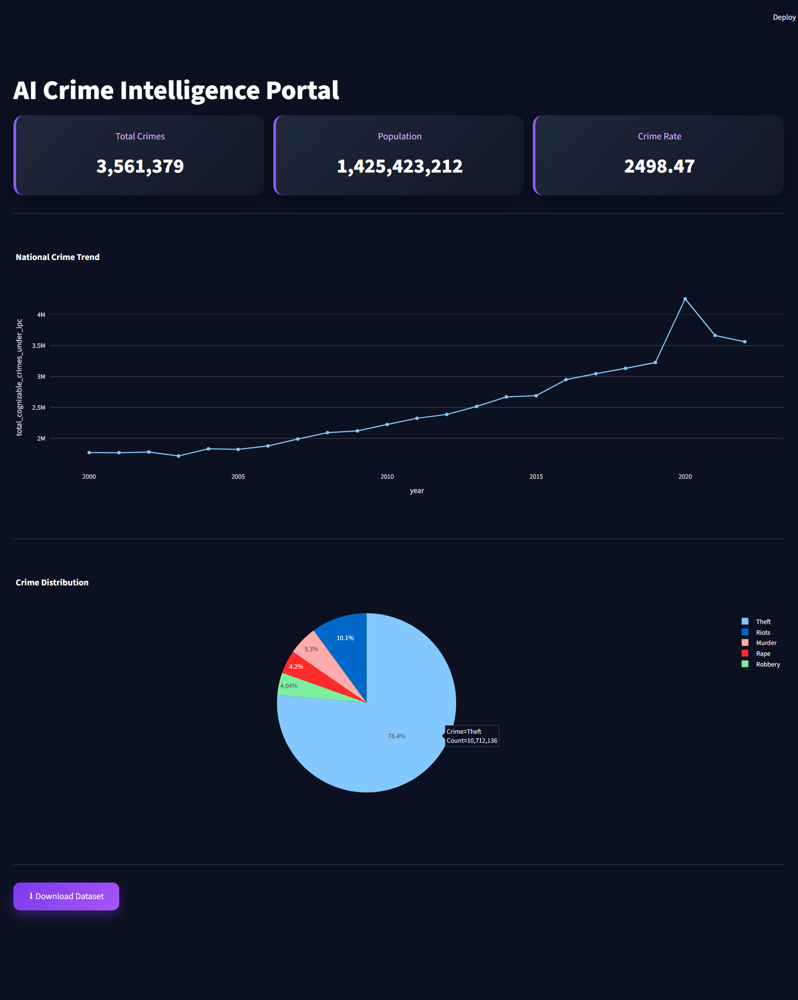

<div align="center">

# 🛡️ CrimeVision AI

### AI-Powered Crime Prediction & Analytics Platform

A modern AI-powered platform that predicts crime trends, analyzes historical crime data, and visualizes actionable insights through an intuitive and responsive interface.

<br>

[]()
[]()
[]()
[]()
[]()

</div>

---

# 🌐 Live Demo

### Landing Website

**https://crimevision-ai-website.vercel.app**

### AI Platform

**https://ai-crime-predictive-analysis.streamlit.app**

---

# 📸 Project Preview

## Landing Page

<p align="center">

</p>

---

## AI Dashboard Preview

<p align="center">

</p>

---

# 🚀 Overview

CrimeVision AI is an end-to-end AI-powered crime prediction and analytics platform designed to transform historical crime data into meaningful insights using Machine Learning and interactive visualizations.

This repository contains the official **Next.js landing page** that introduces the platform and seamlessly connects users to the live AI application.

---

# ✨ Features

- 🛡️ Premium SaaS-inspired landing page
- 🤖 AI-powered crime prediction
- 📊 Interactive dashboard preview
- 🗺️ Crime hotspot visualization
- 📈 Forecasting & trend analysis
- 📱 Fully responsive design
- ⚡ Smooth Framer Motion animations
- 🎨 Modern UI with Tailwind CSS

---

# ⚙️ Tech Stack

| Category   | Technologies               |
| ---------- | -------------------------- |
| Frontend   | Next.js, React, TypeScript |
| Styling    | Tailwind CSS               |
| Animation  | Framer Motion              |
| Icons      | Lucide React               |
| Deployment | Vercel                     |

---

# 📂 Folder Structure

```text
app/
components/
public/
screenshots/
README.md
```

---

# 🧠 AI Platform

The complete AI-powered crime analytics platform is available in a separate repository.

### Features

- AI Crime Prediction
- Crime Forecasting
- Interactive Dashboard
- Crime Analytics
- Heatmap Visualization
- Pattern Analysis
- Secure Demo Login

### Repository

https://github.com/sanjanadwivedi/AI-Crime-Intelligence-Portal

---

# 🚀 Getting Started

Clone the repository

```bash
git clone https://github.com/sanjanadwivedi/YOUR-REPOSITORY.git
```

Install dependencies

```bash
npm install
```

Run the development server

```bash
npm run dev
```

Open

```
http://localhost:3000
```

---

# 📷 Screenshots

| Landing Page                      | AI Dashboard                           |
| --------------------------------- | -------------------------------------- |
|  |  |

---

# 👩‍💻 Developer

### Sanjana Dwivedi

Computer Science Undergraduate

Passionate about Artificial Intelligence, Data Analytics and Machine Learning.

- 🌐 Landing Website: **https://crimevision-ai-website.vercel.app**
- 🚀 Live Platform: **https://ai-crime-predictive-analysis.streamlit.app**
- 💻 AI Platform Repository: https://github.com/sanjanadwivedi/AI-Crime-Intelligence-Portal

---

<div align="center">

### ⭐ If you found this project helpful, consider giving it a star.

Built with ❤️ using Next.js, Tailwind CSS & Framer Motion

</div>
